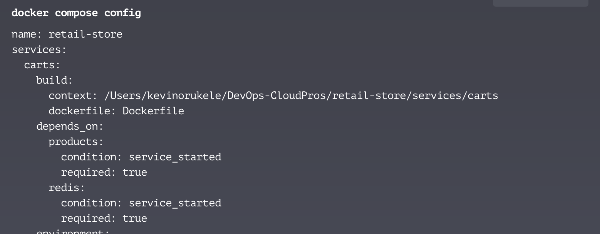
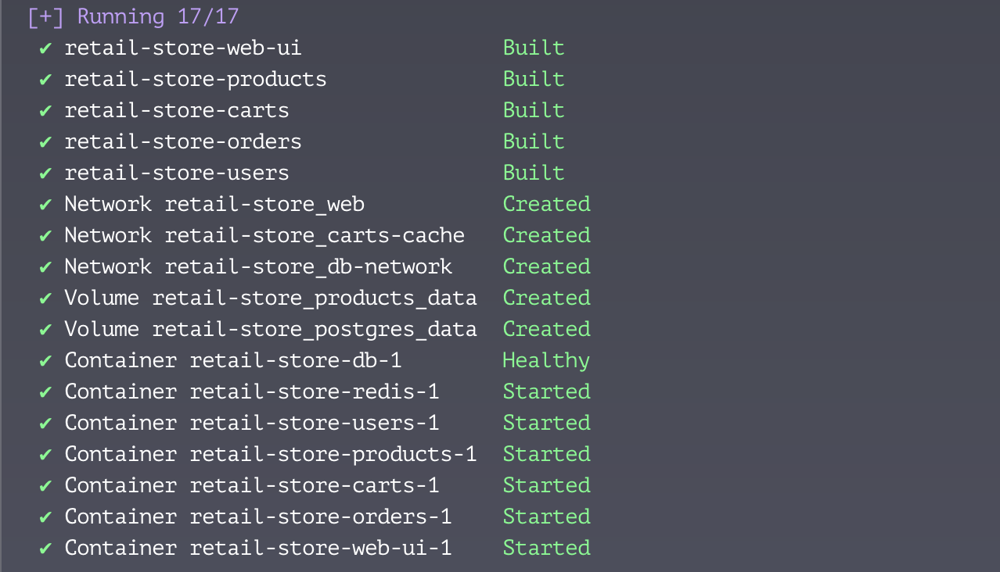
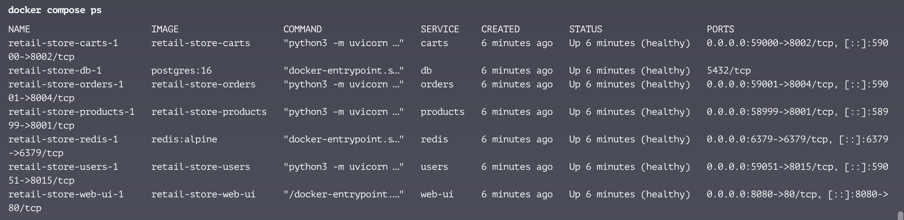

# CloudPros Web Store

Minimal store composed of services: products (SQLite, seeded from FakeStore), carts (Redis),
orders (checkout + cart clear), users (JWT auth with SQLite), and a static web UI proxied via Nginx.

## Run
```bash
docker compose up --build
open http://localhost:8080
```

## Notes
- First start will fetch products from https://fakestoreapi.com/ and cache them locally (SQLite).
- Cart is stored in Redis, keyed by `userId` (guest or auth user id).
- Sign in / Sign up are local only; token stored in localStorage.
- To reset (and reseed), run: `docker compose down -v` and then `docker compose up --build`.

## Orchestration, Health and Evidence

-The aim is to set up the final orchestration layer, ensure stack reproducibility, and confirm all services connect successfully and are reachable through the reverse proxy.

#### Scope
- To create a `docker-compose.yml` file with the below services
  - ###### Services
    - web-ui - also acting as a reverse-proxy
    - products
    - orders
    - carts
    - users 
    - db
    - redis
- Show understanding of `depends_on` and and `healthcheck` conditions 
and apply them properly.
- Add `env.example` file containing all required variables.
- Test the final product end-to-end.

##### Note: I also tested using the Traefik reverse-proxy tool. see `docker-compose.traefik.yml`

#### Acceptance:
- docker compose config result


- docker compose up --build -d result 



I have added the health checks as part of the image.

| Service  | Image                                    | Size    |
|----------|------------------------------------------|---------|
| web-ui   | retail-store-web-ui:latest               | 18.2MB  |
| products | retail-store-products:latest             | 129MB   |
| orders   | retail-store-orders:latest               | 103MB   |
| carts    | retail-store-carts:latest                | 129MB   |
| users    | retail-store-users:latest                | 153MB   |

#### Tested the set-up using the below commands 

```bash
# Shows we can access the web-ui container 
curl -i http://localhost:8080

# Shows we can access the orders container via reverse proxy
curl -i http://localhost:8080/api/orders/health

# Shows we can access the carts container via reverse proxy
curl -i http://localhost:8080/api/carts/health

# Shows we can access the products container via reverse proxy
curl -i http://localhost:8080/api/products/health

# Shows I can retrieve the products list
curl -i http://localhost:8080/api/products/products

# Shows we can access the users container via reverse proxy
curl -i http://localhost:8080/api/users/health
```