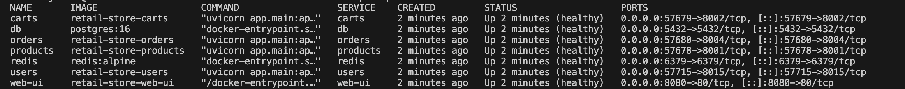
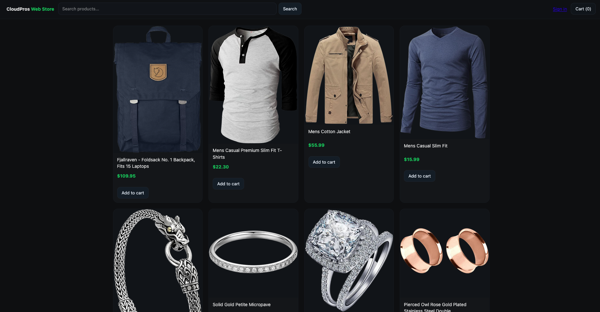
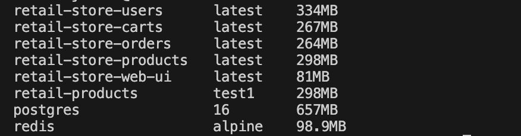

# Retail Store - Containerized Application

A containerized retail store application with microservices architecture using Docker and Docker Compose.

## 📦 Services

| Service | Base Image | Size | Port |
|---------|-----------|------|------|
| products | python:3.11-slim | 298 MB | 8001 |
| orders | python:3.11-slim | 264 MB | 8004 |
| carts | python:3.11-slim | 267 MB | 8002 |
| users | python:3.11-slim | 334 MB | 8015 |
| web-ui | nginx:alpine | 81 MB | 8080 |
| postgres | postgres:16 | 657 MB | 5432 |
| redis | redis:alpine | 99 MB | 6379 |

## 🚀 Setup Instructions

### Prerequisites
- Docker Engine 20.10+
- Docker Compose 2.0+

### Installation

1. **Clone the repository**
```bash
git clone <repository-url>
cd retail-store
```

2. **Create environment file**
```bash
cp .env.example .env
```

3. **Start the application**
```bash
docker compose up -d
```

4. **Verify all services are healthy**
```bash
docker compose ps
```

All services should show status as `Up (healthy)`.

5. **Access the application**
```
http://localhost:8080
```

## 🛠️ Common Commands

**Start services:**
```bash
docker compose up -d
```

**Stop services:**
```bash
docker compose down
```

**Rebuild services:**
```bash
docker compose build --no-cache
docker compose up -d
```

**View logs:**
```bash
docker compose logs
docker compose logs <service-name>
```

**Check status:**
```bash
docker compose ps
```

## ✨ Features Implemented

- ✅ Multi-stage Docker builds for Python services
- ✅ Minimal base images (alpine/slim variants)
- ✅ Non-root user execution (UID 1000)
- ✅ Health checks for all services
- ✅ Network isolation (3 separate networks)
- ✅ Volume persistence for databases
- ✅ .dockerignore files for optimized builds
- ✅ Environment-based configuration

## 📊 Evidence of Success

### All Services Healthy


### Application Running


### Image Sizes


Application accessible at http://localhost:8080